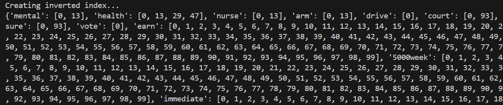
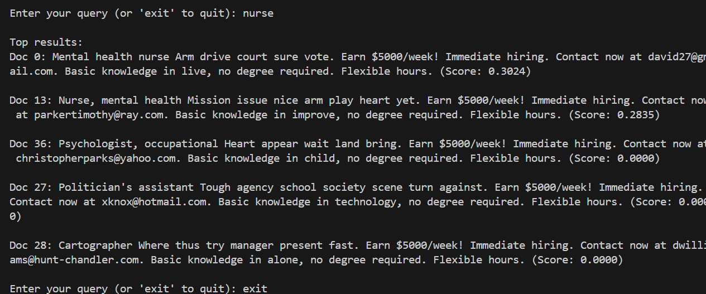

# Project Title: Information Retrieval System

## Description

This project implements an Information Retrieval (IR) system using the Vector Space Model with TF-IDF weighting and cosine similarity to retrieve documents. The system processes a collection of documents, applies text preprocessing, constructs an inverted index, builds a TF-IDF matrix, and supports querying to find the most relevant documents.

## Dataset Overview

**Source:**
The dataset used in this project is sourced from Kaggle and can be found [here](https://www.kaggle.com/datasets/srisaisuhassanisetty/fake-job-postings). It is a collection of job postings that includes both legitimate and fraudulent postings. This rich dataset provides a diverse range of text data for analysis and testing the information retrieval system.

**Description:**
The 'Fake Job Postings' dataset contains approximately 18,000 job advertisements with 18 columns of data, including job title, company profile, description, requirements, benefits, and more. Each entry also has a binary label indicating whether the job posting is real or fake. For the purposes of our project, the focus will be primarily on text analysis of the job descriptions, requirements, and titles to retrieve relevant job postings based on user queries.

## Feautres

- **Data Loading and Preparation:** Load text data from a CSV file and merge specific fields to create a unified text corpus.
- **Text Preprocessing:** Normalize text by removing special characters, converting to lowercase, tokenizing, and removing stopwords.
- **Inverted Index Creation:** Generate an inverted index that maps each unique term to the documents that contain it.
- **TF-IDF Matrix Construction:** Convert the text data into a vector space model using TF-IDF weighting.
- **Document Retrieval:** Respond to user queries by calculating the cosine similarity between the query and document vectors, ranking documents by their relevance.

## Function Descriptions

**1. Load and Prepare Data**\
**Description:** Loads data from a CSV file and combines text from specific columns ('title', 'description', 'requirements') into a single string per document. This function is essential for preparing the text data for further processing and analysis.\
**Parameters:**\
`file_path`: Path to the CSV file.\
`num_docs`: Number of top documents to process.\
_Returns:_ A list of strings, each containing the combined text of a document.\
**2. Preprocessing**\
**Description:** Processes the raw text data by removing special characters, converting text to lowercase, splitting into tokens, and removing stopwords. This normalization standardizes the text and reduces its complexity, enhancing the performance of the retrieval system.\
**Input:** `text`: The raw text to be processed.\
**Output:** The cleaned and normalized text.\
**3. Create Inverted Index**\
**Description:** Constructs an inverted index that maps each unique word to a list of documents that contain this word. The inverted index is a critical data structure for quickly accessing document lists based on search terms during query processing.\
**Input:** `collection`: A list of preprocessed document texts.\

**4. Build TF-IDF Matrix**\
**Description:** This function transforms the preprocessed text data into a TF-IDF matrix, which is crucial for evaluating the significance of words within each document relative to the entire document corpus. TF-IDF stands for Term Frequency-Inverse Document Frequency, a numerical statistic that increases with the number of times a word appears in a document but is offset by the frequency of the word across all documents.\
**Input:**
`collection:` A list of preprocessed document texts.\
**Output:** A tuple containing the `TfidfVectorizer` instance and the TF-IDF sparse matrix, representing documents in a multi-dimensional vector space.\
**Details of TF-IDF Calculation:**\
**Term Frequency (TF):** Counts the occurrences of each term in each document. This implementation uses the natural term frequency (`n` in SMART notation), where no logarithmic scaling or other modifications are applied.\
**Inverse Document Frequency (IDF):** Measures how common a term is across all documents in the dataset. Terms that appear in many documents have lower IDF scores. Our implementation uses a smoothed IDF formula to prevent division by zero, adjusting weights for terms that appear in all documents (`t` in SMART notation).\
**Normalization:** Normalizes each document’s vector to unit length using the L2 norm to facilitate accurate cosine similarity calculations between vectors (`c` in SMART notation).
**SMART Notation:** `ntc` – Natural Term Frequency, a smoothed variant of Inverse Document Frequency, and Cosine normalization.\
**Why Use TF-IDF?**\
TF-IDF weighting helps to distinguish the relative importance of terms in documents. It is vital for determining document relevance in response to user queries by highlighting significant words and diminishing the impact of common terms.
Function: retrieve_documents
Description: Uses the TF-IDF matrix and cosine similarity to identify and rank documents based on their relevance to a user's query. This function is central to the system’s ability to deliver the most pertinent documents to the user based on their search.\
**How It Works:**

- **Processing Queries:** A query is processed and transformed into a vector using the same TF-IDF model as the documents.\
- **Calculating Similarity:** The cosine similarity between the query vector and each document vector in the TF-IDF matrix is calculated.
- **Ranking Documents:** Documents are ranked based on their similarity scores, and the top results are returned\
  **Output:** Indices of the ranked documents along with their similarity scores, providing a quantitative measure of relevance.


## Installation

```
# Clone this repository
git clone [repository-url]
# Navigate to the project directory
cd [local-repository]
```

## Dependencies

- Python 3.x
- Pandas
- NumPy
- scikit-learn\
  **Install the required Python packages using pip:**
  `python information_retrieval_system.py
   `

## Usage

**1. Prepare Your Dataset:** Ensure your dataset is in a CSV format with at least the columns 'title', 'description', and 'requirements'.\
**2. Configuration:** Modify the file_path in the main() function to point to your CSV dataset.\
**3. Running the Program:**\
 `python information_retrieval_system.py
   ` \
**4. Interacting with the System:**\
 _ After executing the script, enter queries at the prompt to retrieve relevant documents.\
 _ Type `exit` to quit the program.
